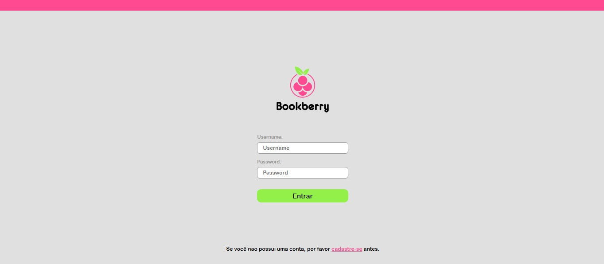
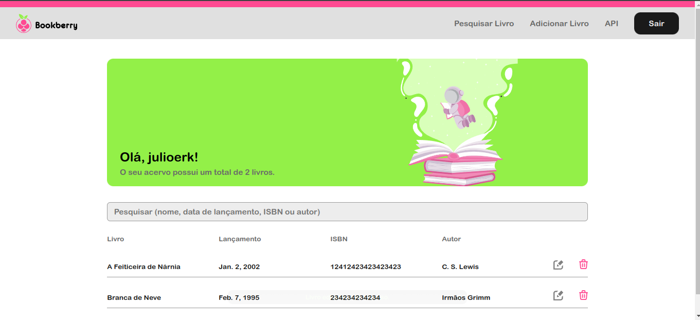
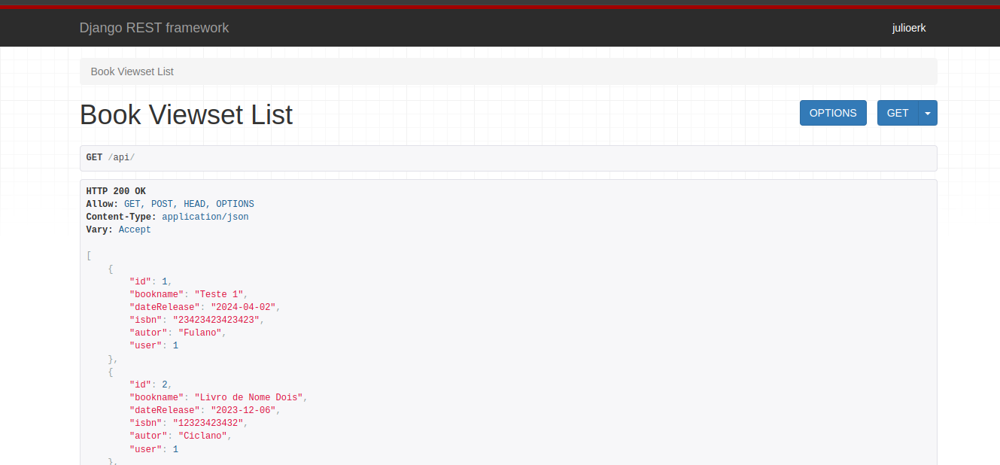
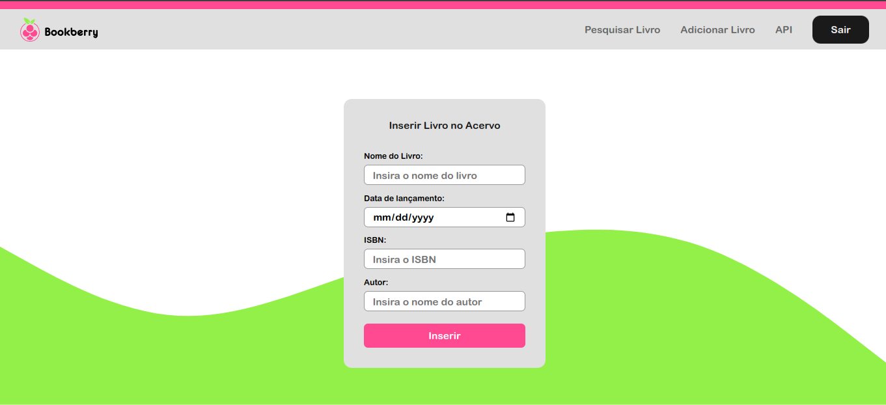
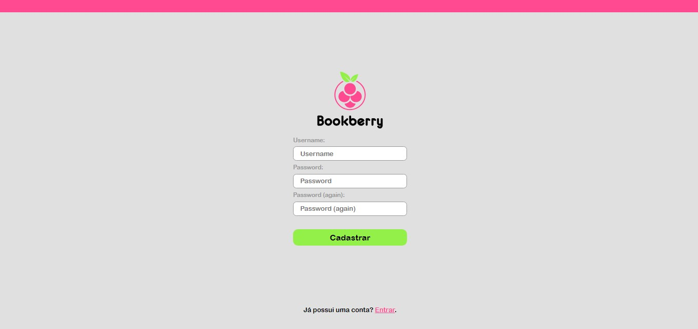
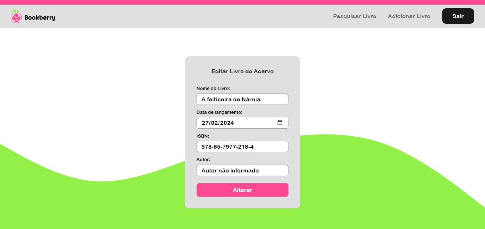

# Bookberry - Sistema de Gerenciamento de Acervo de Livros

 <br /> <br />
 <br /> <br />

## Descrição
Bookberry é uma aplicação web desenvolvida em Python com o framework Django, projetada para facilitar o gerenciamento de um acervo de livros. Com Bookberry, você pode pesquisar, inserir, visualizar, deletar e editar informações sobre livros de forma eficiente e organizada. Também, o Bookberry possui uma API para desenvolvedores, isso permite o desenvolvimento de sistemas que irão utilizar o core do Bookberry como base.

## Tecnologias Utilizadas
- Python
- Django
- Django Rest Framework
- SQLITE

## Funcionalidades Principais
- **Pesquisa:** Encontre rapidamente livros utilizando a função de pesquisa.
- **Inserção:** Adicione novos livros ao acervo de forma intuitiva e fácil.
- **Visualização:** Veja detalhes completos sobre os livros armazenados.
- **Deleção:** Remova livros do acervo quando necessário.
- **Edição:** Atualize as informações dos livros conforme necessário.

## API
Bookberry possui uma API para acesso aos dados do usuário, requer autentificação por token.
Endpoints da api:
Acesso principal: '/api'
Alteração, deleção e similares: '/api/<id>'
Geração de token (requer login): '/api-token'
Atualização de token: '/api-token/refresh/'


'api-token/refresh/'
 <br /> <br />

## Requisitos de Instalação
Certifique-se de ter o Python instalado em seu sistema antes de prosseguir.

1. Clone o repositório do GitHub:
    ```
    git clone https://github.com/seu-usuario/bookberry.git
    ```
2. Acesse o diretório do projeto:
    ```
    cd bookberry
    ```
3. Instale as dependências usando pip:
    ```
    pip install -r requirements.txt
    ```
4. Configure as variáveis de ambiente para conexão com o banco de dados PostgreSQL.

## Configuração do Banco de Dados
Certifique-se de configurar corretamente o banco de dados fazendo as migrações.

## Executando a Aplicação
Você pode iniciar a aplicação Django usando o seguinte comando:
```
python manage.py runserver
```

Acesse a aplicação em seu navegador, geralmente disponível em [http://127.0.0.1:8000/](http://127.0.0.1:8000/).

 <br /> <br />
 <br /> <br />
 <br /> <br />

## Contribuindo
Contribuições são bem-vindas! Sinta-se à vontade para abrir issues ou pull requests com melhorias, correções de bugs ou novas funcionalidades que você gostaria de ver implementadas.
